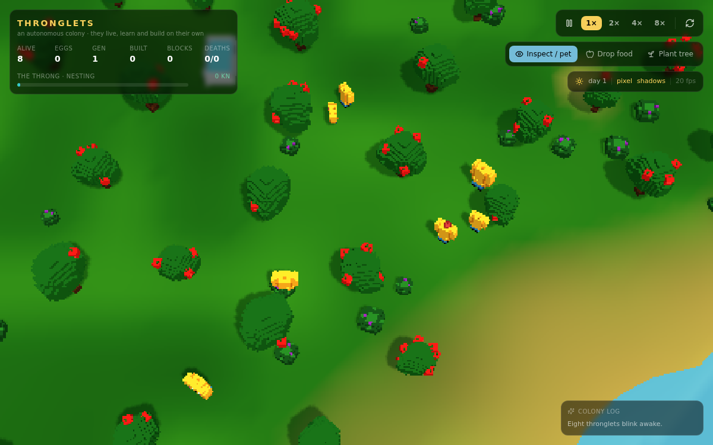

# Thronglets

A colony of little yellow voxel creatures that live, learn and build on their
own, rendered in three.js. Inspired by the Tamagotchi-like creatures in the
*Black Mirror* episode "Plaything" — an unaffiliated fan project.

It opens as a naturalist's monograph — printed paper, Garamond, ruled data
tables, red annotations — because every simulation and AI toy reaches for the
same two skins, dark glass or a green terminal, and both say *software* rather
than *place*. You are whoever is keeping the notebook. That is the frame, and
the colony eventually notices it — see [Being watched](#being-watched).

The island runs 230 units across, with around fourteen hundred trees of four
kinds, four hundred boulders in fields, thirty ponds, room for fourteen clans
and up to five hundred and sixty creatures at once. A seed takes about a week
of colony time to fill the near half of it; the far shores stay empty until
somebody's grandchildren decide to walk out there.

Nothing about the colony is scripted. Every creature scores its own drives once
a second and acts on whichever shouts loudest, so where they settle, what they
build, who they pair off with and whether the colony thrives are all emergent.
Watch long enough and you'll see a village appear, generations turn over, and
inherited traits drift across the population.



## Running it

```bash
npm install
npm run dev      # http://localhost:5173
```

`npm run build` produces a static site in `dist/` — it's a pure client-side
app, so that folder can be served from anywhere.

## Playing

The sim opens on a top-down view of the island.

| Input | Does |
| --- | --- |
| Drag | Orbit the camera |
| Scroll / pinch | Zoom |
| Click a creature | Inspect its needs, traits and current thought |
| Click it again | Pet it |
| `1` / `2` / `3` | Inspect · drop food · plant a tree |
| `space` | Pause |
| `f` | Focus the selected creature |

Speed runs up to 8×, and the refresh button in the corner grows a brand new
island. `plate`, `shadow` and `names` toggle the pixel look, the expensive
lighting, and the town names lettered onto the island — which are the words
the clans coined for themselves, so the island reads as a map of somewhere
rather than scenery.

## People, not agents

Each creature holds up to eight relationships with specific named individuals,
built out of things that actually happened between them: who fed it when it was
starving, who raised it, who it has children with, who struck it. The inspector
shows *“Vek — fed me when I was starving”*, not “sociability 0.7”.

It changes what they do. "Go and find a friend" used to mean *walk to the
nearest body*. Now one will walk past three neighbours to reach the person who
fed it once, and will not seek out somebody who hit it.

When somebody dies, everyone bonded to them takes it — they stop wanting to
play, they seek company, and the name keeps surfacing in their thoughts. A
clan losing someone who mattered is visible in the village without opening a
panel, because a dozen creatures go quiet at once.

Nobody is appointed to anything. Standing is earned by feeding the hungry,
raising children, laying stone and working things out, and a people simply
defers to whoever has most of it — *the Fenbough stop listening to Nazz and
turn to Flush.*

## Peoples and gods

The island fills with clans. Each is a village, a bloodline and a religion at
once — a god, a sacred thing, a creed, and a banner colour its members wear as
a tint. They build outward in rings from where they settled, gather at their
shrine at dawn and dusk, carry their god to neighbours who have not heard of
it, and split when they grow too big to agree with themselves.

The peoples panel lists who is alive, what they worship, who they defer to,
and what they hold against the others; click one to fly to its village.

## War, which takes weeks

A war is the end of a long argument, and it needs three things at once:

1. **Remembered injury**, with dates and names — a killing, a raid, a theft, a
   conversion, a border pressed, a god said wrong. Standing complaints accrue
   at a trickle and take days of sustained friction to become worth fighting
   over, and they fade if you leave a people alone.
2. **Organisation.** Mustering needs the age of Craft: kilns, carts, kept
   accounts, a people organised enough to send fifteen of its own somewhere
   and feed them when they get there.
3. **Nobody holding it back.** Every marriage across the line is a family with
   people on both sides, and it raises the bar.

The declaration names what it is actually about — *the Ashmire and the Margate
go to war over their dead* — and the grudges behind it are listed with their
dates. Grief wears a war out, written law wears it out faster.

In a verified 32-day run the first war broke out on **day 26**, one war at a
time, one killing in total.

## The long climb

Seventeen technologies over six ages, and none of them on a timer.

| Age | What they work out |
| --- | --- |
| **Wandering** | fire · knapping · burial |
| **Hearth** | cooking · baskets · weaving |
| **Settled** | sowing · pottery · masonry |
| **Craft** | the kiln · the wheel · counting |
| **Forge** | smelting · writing · medicine |
| **Watching** | astronomy · law |

A technology accrues effort only while somebody is *actually standing in the
situation that would suggest it* — awake and freezing beside a woodpile,
hungry within reach of a fire, hauling a load too heavy, burying a third
sibling, laying a stone that will not sit flat. A people on easy ground climbs
slowly because nothing is pressing it. An age is a floor: nothing above it
starts until the one below is finished, so the ladder is climbed in order.

Being taught beats inventing. Where two peoples on good terms live close
enough to see each other work, the one behind picks up the one ahead about
three times faster than working it out alone — so an island of feuds does not
climb, and a friendly neighbour is worth more than a good quarry. A schism
carries the whole toolkit out with it.

Each age brings buildings: hearths, then granaries and wells and grove plots,
then a kiln, then a forge and an archive, and finally a hall and an
observatory — which is a people deliberately looking for whatever is up there.

## Weather, and working things out

The island turns through four seasons on an eight-day year. Snow settles in
the cold, whitens the trees, stops things growing and melts when the warmth
comes back. Warmth falls at night, and an exposed creature on a cold night
burns energy, loses condition, and cannot sleep through it.

That pressure is what makes them invent. Nothing is unlocked by a progress
bar — somebody works a thing out because of where they happen to be standing,
and it is logged with their name:

> **First fire on the island — Snool of the Cinderhollow.**
> *Snool of the Cinderhollow works out fire on a bitter night.*

Hearths cannot be built by a people who have not worked fire out; wells and
watchtowers wait on masonry; grove plots on sowing. Nothing in the world is
available because a number went up.

Knowing a word is personal too: each creature only knows what it has said or
heard, and picks words up one at a time from whoever it is standing next to.
A coinage starts with one speaker and spreads through the clan — and slides
back when children are born who have not heard it yet. The first word, the
first snow, the first rain: each logged as news once, and never again.

## Being watched

The colony slowly works out that something is looking at it.

Attention is driven by how far they have **climbed** — the age the leading
people has reached — plus every monolith and observatory they finish. Scoring
it off raw activity made a big colony suspect it was watched inside a week
purely by laying a lot of blocks; an age is the honest measure, because it is
the thing that takes weeks to move. It eases towards its target rather than
jumping, so the island takes days to arrive at the idea.

As it climbs, individuals start catching it. One stops mid-job, turns to face
wherever your camera actually is, tips its head back and holds there, thinking:

> *the sky is close today. · something is above the sky. · it does not blink. ·
> it moved when I moved. · we are being counted. · why us. · it lifted Vek. it
> put him back. · hello? · you.*

The first few times the island reaches for the thought it is logged as news,
alongside first fire and first snow. A red line is struck through the
observer's own record — **they are aware of being observed** — with a count of
how many are looking up right now.

And then their words start appearing in the margins of your page: real
coinages out of their own lexicon, scrawled in red, more of them the higher it
goes, multiplied into the paper so they read as ink soaking through rather
than an overlay. The notebook stops being solely yours. Move the camera and
their heads follow it, because they are tracking the camera and not a marker
on the ground.

Picking one up and putting it back down feeds this. So does doing nothing at
all, eventually.

## An island with materials

Four kinds of tree, placed where they belong: palms along the shore, pines on
the high ground, oaks through the deep inland, apples everywhere temperate.
Only apples and palms fruit — oak and pine are what you build from. Boulders
outcrop in fields and hold stone that does not grow back.

Every block in a building is timber, stone or free thatch, so gatherers fetch
whichever their town is short of, and quarrying stone is slower than chopping
wood. A town that fills its rings breaks ground on a second settlement nearby.
Wells go by the water; granaries get filled on good days and emptied on bad
ones.

Each clan tallies what has actually killed its people and builds against it —
two deaths from thirst and they dig a well before anything else, three raids
and they put up a watchtower. A clan on good ground never bothers with any of
it.

Creatures come in seven colour schemes, inherited from a parent with a small
chance of something new, so towns drift towards a look of their own.

## A working civilisation

Nobody is assigned a job. Each creature settles into forager, builder,
quarrier, farmer, priest or warrior from its own traits crossed with what its
town is short of, and reconsiders as things change — a site short of stone
turns foragers into quarriers, three raids and a clan starts producing
warriors.

Grove plots yield only if a farmer works them, and tended ground beats a wild
grove by a mile: that is the step that lets a town outgrow the trees around
it. Towns are named in their founders' own language the day they are founded.

Roads are not planned. Ground remembers being walked on, wear fades where
nobody goes, and the routes that survive show up as bare earth between the
places people actually go.

Clans on good terms send caravans of food to each other, which raises
relations by more than proximity ever does and carries a word across between
their languages on the way — the alternative to the other thing two peoples do
when they meet.

## Their own language

Each clan invents its own words. It gets a sound system when it is founded,
coins words for whatever its members actually do, and swaps words with
neighbouring clans — where they come out changed, run through the borrower's
own sounds. Words drift as they travel: in one run `shongmir` (sleep) was
borrowed as `sheengmir` and passed on as `sheengming`, while `moungou` (food)
crossed three villages intact. The peoples panel lists every clan's
vocabulary, marks the loanwords, and reports how far their tongues have
drifted apart.

## Picking them up

Press and hold on a creature and it dangles from the cursor. Drag it anywhere
and let go — the camera stays put while you have hold of one. Dropped in water
it panics out; dropped far from home it turns round and walks back.

## The Oracle: bring your own model

There are two modes, and the default needs nothing: **no model**, where they
name their own gods, word their own creeds and invent their own vocabulary
procedurally. Or connect a **language model** and it writes the scripture
instead. Open the brain icon and pick:

| Provider | Models offered | Notes |
| --- | --- | --- |
| **Claude** | Opus 5 · Sonnet 5 · Haiku 4.5 | Called from the browser with the direct-browser-access header. |
| OpenAI | GPT-4o · 4o-mini · 4.1-mini | The standard `/v1/chat/completions` API. |
| Gemini | 2.0 Flash · Flash-Lite · 1.5 Pro | Google AI Studio. A free-tier key works. |
| Local (Ollama) | whatever you have pulled | `ollama serve` with `OLLAMA_ORIGINS=*`. No key, nothing leaves the machine. |
| Anything OpenAI-compatible | — | LM Studio, vLLM, llama.cpp, OpenRouter, your own proxy. |

**Ask the endpoint** fetches the real model list where the API allows it, and
**test the connection** does one tiny round trip so you find out the key is
wrong now rather than the first time a clan tries to name its god. It can then
name the gods and word their creeds, speak for whichever creature you have
under observation, read the age they have reached, read a clan's invented
language back to you, or turn the record into a chronicle. It is off by default,
every piece of text has a procedural fallback, and the endpoint, model and key
stay in your browser's localStorage.

## What the creatures actually do

Each one carries hunger, thirst, tiredness, loneliness and a need to play,
plus inherited traits for speed, size, curiosity, sociability, industry and
lifespan. Once a second they score every option available to them — eat,
drink, sleep, socialise, play, gather wood, build, court a partner, wander —
and commit to the winner.

- They **remember** where they found food and water, and hand those memories
  over when they stop to chat, so a good grove spreads by word of mouth.
- A shared knowledge pool, **the Throng**, grows with population,
  conversations and finished buildings. Crossing a threshold teaches the
  colony something new to make: cairn → hut → shrine → grove plot →
  watchtower → monolith.
- **Building** is real work: wood gets chopped from trees, carried to the
  site and stacked one block at a time. Finished walls are solid.
- Two well-fed adults who spend enough time together lay an **egg**, and the
  baby inherits a mix of both genomes with a little mutation — including a hue
  shift you can see. It grows through child and adult into an elder, and
  eventually dies of old age.

There's a per-creature inspector for all of this, and a colony log in the
corner recording births, deaths and finished buildings.

## Layout

```
src/
  Thronglets.tsx        the page: canvas + HUD
  thronglets/
    colony.ts           the simulation — needs, AI, building, breeding, attention (no three.js)
    tech.ts             the ladder: 17 technologies over 6 ages
    scene.ts            rendering and input
    models.ts           every model, authored voxel by voxel
    voxel.ts            voxel grid → geometry baker
    world.ts            island heightmap, ponds, flora scattering
    clans.ts            clans, faiths, creeds, relations, discoveries
    language.ts         invented tongues: phonology, coining, borrowing, drift
    weather.ts          seasons, sky, warmth, lying snow
    llm.ts              optional language-model bridge
    emotes.ts           pixel-art emote icons drawn at runtime
    random.ts           seeded RNG
```

[src/thronglets/README.md](src/thronglets/README.md) goes into how the AI and
the renderer work.

## Built with

React + TypeScript, Vite, Tailwind, three.js. No art assets — every model,
texture and icon is generated in code.
