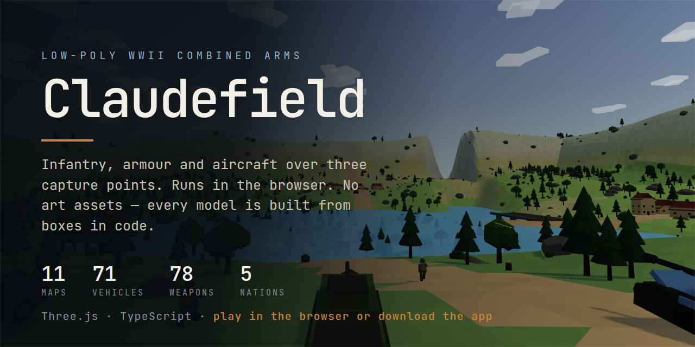
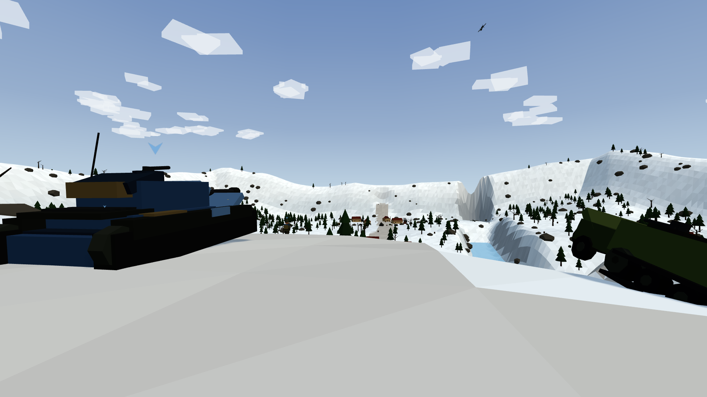
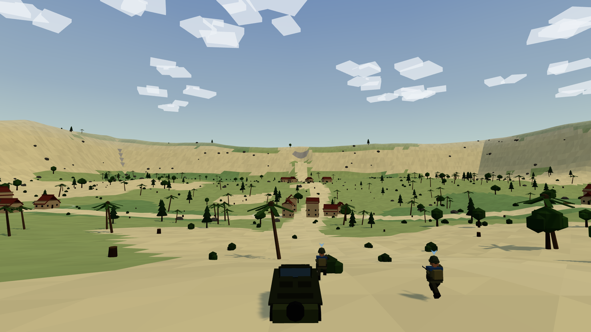
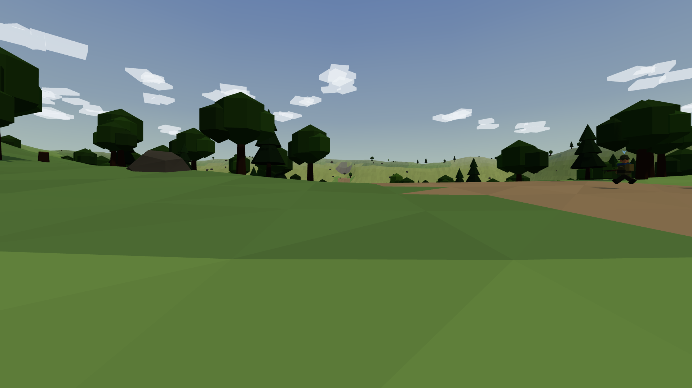
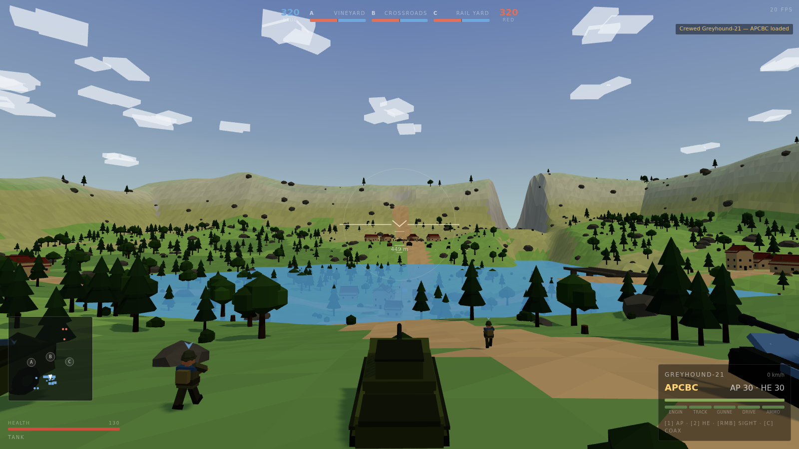

<p align="center">
  
</p>

<h1 align="center">Claudefield</h1>

<p align="center">
  A low-poly WWII combined-arms battle that runs in a browser tab.<br>
  Infantry, armour and aircraft over three capture points — 11 maps, 71 vehicles,
  78 weapons, five nations.
</p>

<p align="center">
  <a href="https://skystrikerr.github.io/project_armafield/"><b>▶ Play in the browser</b></a>
  &nbsp;·&nbsp;
  <a href="../../releases/tag/latest"><b>⬇ Download for Windows / macOS / Linux</b></a>
</p>

---

## Play it

**In a browser** — nothing to install, nothing to sign in to:
**[skystrikerr.github.io/project_armafield](https://skystrikerr.github.io/project_armafield/)**

> The site goes live once Pages is switched on for the repository:
> **Settings → Pages → Build and deployment → Source: GitHub Actions**. That is
> a one-time click; the `Deploy web version` workflow publishes every push
> after it.

**As a desktop app** — grab the file for your platform from
**[Releases → latest](../../releases/tag/latest)** and run it. Every push to
`main` rebuilds all three on real runners.

| Platform | File | Notes |
| --- | --- | --- |
| Windows | `Claudefield-*-windows.exe` | Portable — double-click it, nothing installs. It is unsigned, so SmartScreen warns once: **More info → Run anyway**. |
| macOS | `Claudefield-*-mac-*.dmg` | Unsigned too: right-click the app → **Open** the first time. Intel and Apple Silicon builds both published. |
| Linux | `Claudefield-*-linux.AppImage` | `chmod +x` it and run. |

The desktop app is the same build as the web version wrapped in an Electron
window — no cut-down port, no separate codebase, and no network needed once it
is on disk.

## Controls

Mouse and keyboard, or a controller — every menu is fully navigable with a
gamepad, including the loadout screens.

| | Keyboard / mouse | Controller |
| --- | --- | --- |
| Move / look | `WASD` · mouse | Left stick · right stick |
| Fire | Left mouse | `RT` |
| Aim / tank sight | Right mouse | `LT` · right-stick click |
| Sprint · jump · crouch · prone | `Shift` · `Space` · `C` · `Z` | `L3` · `A` · `B` · `Y` |
| Reload | `R` | `X` |
| Grenade | `G` | `LB` |
| Enter / leave a vehicle | `F` | `RB` |
| Switch weapon · pick a shell | `1` `2` `3` | D-pad |
| Drop a bomb | `B` | D-pad down |
| Third person | `V` | `Back` |
| Pause | `Esc` | `Start` |
| Mute | `M` | — |

## What is in it

**Five WWII nations** — United States, United Kingdom, Soviet Union, Germany
and Japan — each with its own small arms, uniforms and helmets, plus two Great
War armies on the WWI maps.

**71 vehicles**: 26 tanks and tank destroyers, 13 aircraft, 11 transports, five
artillery pieces and the light stuff. Armour is modelled rather than hit-pointed
— shells have a calibre, plates have a thickness and an angle, `effective =
thickness / cos(impact angle)`, and a hit past about 70° ricochets. Damage lands
on modules (engine, tracks, gunner, driver, ammo rack), so a knocked-out tank is
knocked out in a specific way.

**11 maps** across seven biomes, each generated from a seed — terrain, rivers,
lakes, coastlines, bridges, craters, trench lines and bunkers are all placed by
the generator, not hand-built:

| Map | |
| --- | --- |
| **Valley Sector** | Three villages along a road through a shallow valley. Mixed arms. |
| **Bocage** | Tight hedgerows and sunken lanes. Infantry country — armour gets ambushed. |
| **Open Steppe** | Long sightlines and almost no cover. Tank and aircraft ground. |
| **Coastal Airfield** | Airstrips, water crossings and a beach. Favours aircraft and amphibians. |
| **Falcon's Pass** | An alpine river valley. Two bridges are the only way across — take one or swim. |
| **Frost-Hammer** | The same pass under snow. Pale ground, close haze, and a freezing river. |
| **Frost-Guard Peaks** | Churned mud and dead trees. More shell hole than field, under a grey sky. |
| **Frost-Guard Trenches** | The same shelled ground under snow. Dead trunks, white craters and a frozen watercourse. |
| **Frost-Guard Summit** | High alpine snow. Heavy pine on the flanks and a frozen lake filling the east. |
| **Atlantic Wall** | Landing beach under the guns. Cross the sand, climb the bluff, take the hedgerows behind it. |
| **Fortress Island** | The same shore, harder. A battery on the headland and a shelled trench belt inland. |

**A roster you set yourself.** Before a match you pick each side's nation and
tick exactly which weapons and vehicles it may field — per map, saved per map,
so the Bocage roster stays different from the Steppe one. Five presets seed it:

| Preset | |
| --- | --- |
| **All-Out Warfare** | Everything unlocked. Tanks, trucks, aircraft, the lot. |
| **WW2 Historical** | Each side fields only what it historically operated. No shared kit. |
| **Infantry Only** | No vehicles at all. Rifles, SMGs and the ground between you. |
| **Armor Clash** | Tanks and tank destroyers only. Bring AT weapons. |
| **Air Superiority** | Aircraft and light ground transport. The fight is overhead. |

<p align="center">
  
  
  
  
</p>

## No art assets

There are no models, textures or image files in this repository — `docs/` holds
screenshots and that is all. Every tank, aircraft, rifle and tree is built at
runtime out of boxes, cylinders, cones and spheres, merged into one flat-shaded
geometry with per-vertex colours. A Tiger's running gear is a function; so is a
Spitfire's wing and a Lee-Enfield's magazine. It is why the download is small
and why a new vehicle is a data edit plus a mesh function rather than an
asset pipeline.

## Building it

```bash
npm install
npm run dev        # http://localhost:5173
npm run build      # static site in dist/ — serve it from anywhere
npm run check      # tsc --noEmit
```

Desktop builds (each target needs its own OS — `electron-builder` shells out to
platform-native tools):

```bash
npm run dist:win     # → release/Claudefield-*-windows.exe
npm run dist:mac     # → release/Claudefield-*-mac-*.dmg
npm run dist:linux   # → release/Claudefield-*-linux.AppImage
```

`electron/main.cjs` is the whole desktop shell: one `BrowserWindow` loading
`dist/index.html` off disk.

## How it is put together

```
src/
  main.tsx            entry
  Ironfront.tsx       React shell — HUD, menus, deploy screens
  MatchSetup.tsx      the pre-match roster editor
  gamepadMenu.ts      controller navigation for every DOM overlay
  ironfront/
    game.ts           the loop: input, camera, vehicles, phases
    matchConfig.ts    the catalog — every vehicle, map and preset lives here
    arsenals.ts       per-nation small arms and classes
    eras.ts           nations, sides, which army fields what
    terrain.ts        biomes and the terrain generator
    vehicleModels.ts  chassis geometry
    weaponModels.ts   weapon geometry and uniforms
    models.ts         shared low-poly primitives
    combat.ts         ballistics, penetration, module damage
    ai.ts / units.ts  bots and unit state
    effects.ts / audio.ts
```

`matchConfig.ts` is the single source of truth for what may spawn. Adding a
vehicle is a data entry there plus a mesh function in `vehicleModels.ts` —
nothing else needs to know.

Three.js · TypeScript · React · Vite · Tailwind · Electron.

## Licence

Code: MIT (see `LICENSE`). The bundled JetBrains Mono subset in `src/fonts/` is
SIL Open Font License 1.1 — its licence travels with it in `src/fonts/OFL.txt`.
